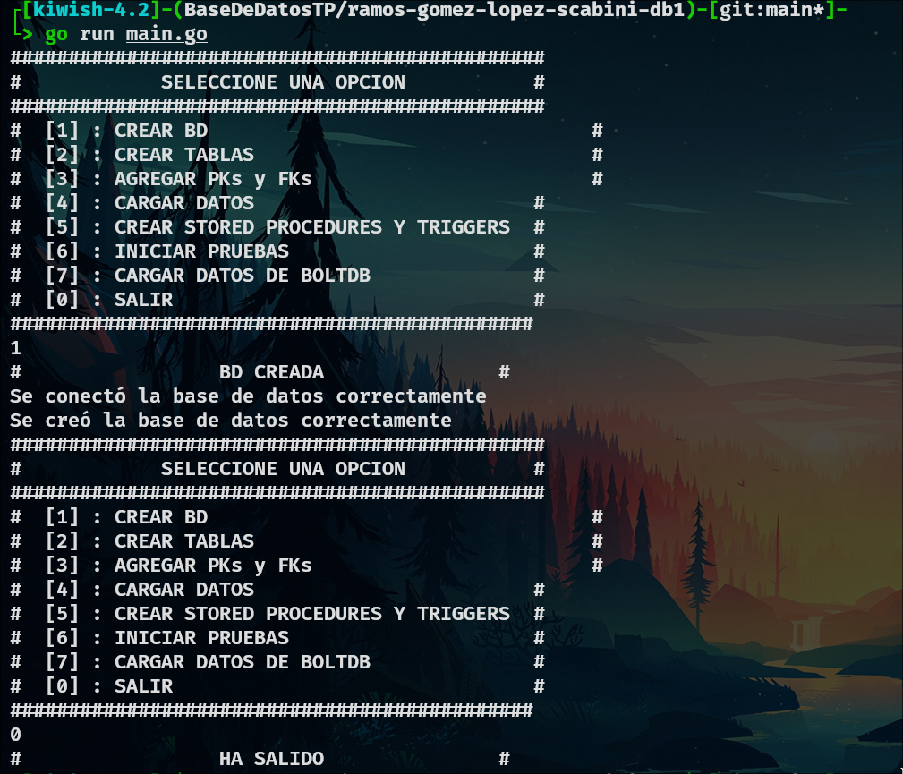
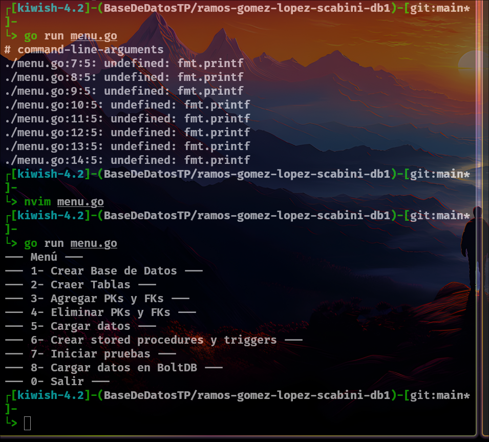
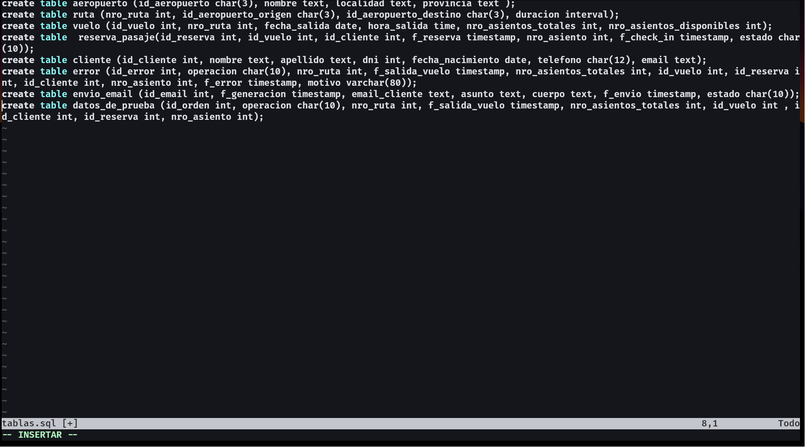
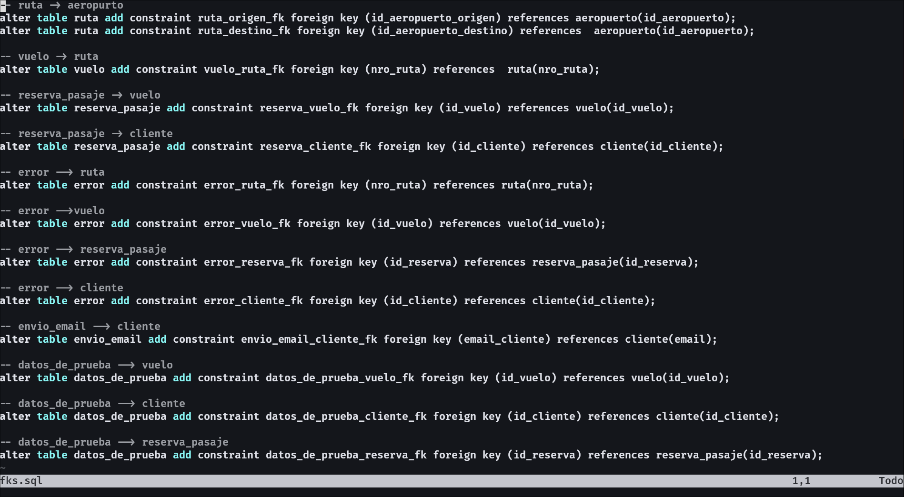
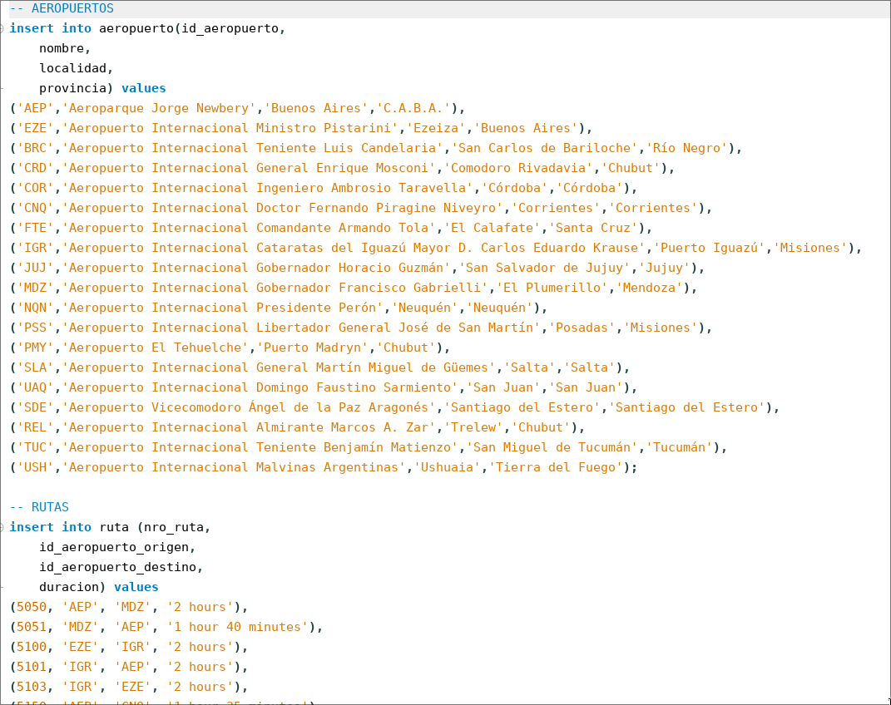
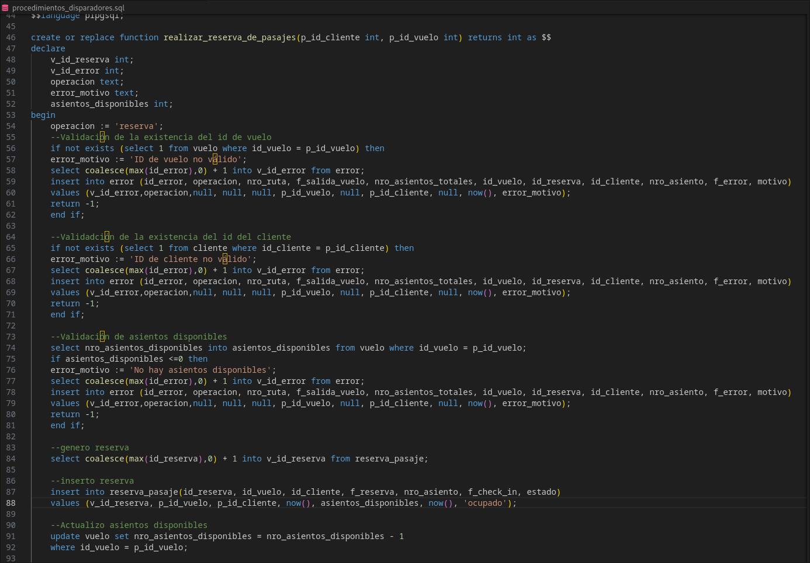
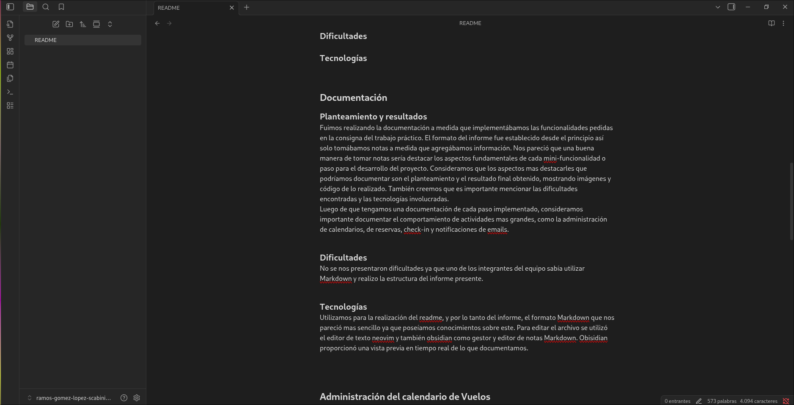

# ramos-gomez-lopez-scabini-db1

## Trabajo Práctico de Bases de Datos 1

Alumnos: Luka A. Gómez - Ciro López - David Ramos - Melina Scabini

Profesores: Hernán Rondelli - Ximena Ebertz (COM-01)

## UNGS - Segundo Semestre 2025
---
### Introducción
---

Este trabajo práctico implementa un sistema completo para gestionar vuelos, reservas, check-in y envíos de email usando PostgreSQL y una aplicación en Go. Se desarrollaron procedimientos almacenados, triggers y una capa de exportación a BoltDB para almacenar datos serializados en formato clave–valor. Además, se incluyó un menú en Go para automatizar la creación de la base, carga de datos, ejecución de pruebas y exportación hacia BoltDB.

## Creación de la base de datos, tablas, constraints e inserción de datos
---
### 1- Creación de la base de datos desde el menú de Go

#### Planteamiento y resultados
Pudimos resolver esta problemática gracias a la diapositiva de Go and Databases que es bastante clara. No tuvimos mayor dificultades mas que errores de tipeo o de lectura del código de la diapositiva. Al haber programado en otros lenguajes como Java y C, Go nos resultó mas amigable y fácil de entender.

*Imagen donde se muestra que se creó la base de datos con éxito*

#### Dificultades

Surgieron dos errores durante la implementación del menú.
El primero fue un error de tipeo al mostrar el menú, ya que se escribió `fmt.printf("")` en lugar de `fmt.Printf("")`.  
El segundo error surgió por seguir el código de las diapositivas de ejemplo y probar rápido ya que se utilizó el especificador de formato `%s` en la función `fmt.Scanf`en vez de `%d`, dado que el valor ingresado por el usuario era un número entero y no una cadena.

*Imagen donde se muestra  el error de escritura al momento de hacer el print.*  
Tuvimos problemas con la función de **conectarABaseDeDatos** ya que no nos devolvía la base de datos, para saber como hacer eso reccurrimos a la documentación oficial de go: https://pkg.go.dev/database/sql
Para la creación de modulo de dependencia, tuvimos que realizar el comando go get github.com para poder hacer que funcione _ "github.com/lib/pq", supimos como hacerlo gracias a la terminal que nos dio el comando. Surgió también problemas por llamar a la función del menu con go y luego el nombre, haciendo que no se muestre nada en la terminal.  
Luego tuve el problema de database is closed que surgió por no mover el código: defer db.Close() que estaba en la diapositiva de conectarse a una base de datos, por lo que se conectaba y se cerraba antes de crear la base de datos.

### 2- Creación de Tablas

#### Planteamiento y resultados

Para la creación de tabla lo que utilizamos fue el editor de texto geany.  No fue un desafió demasiado grande ya que en las diapositivas se mostraba de forma clara como crear una base de datos con los tipo de valores correspondientes y limitando caracteres.

*Imagen donde se muestra la creación de tablas desde el editor de texto nvim desde GNU-Linux Fedora.*

#### Dificultades

Para la creación de tablas no nos encontramos con ninguna dificultad que demorara el desarrollo del proyecto, con seguir las diapositivas brindadas en la materia fue mas que suficiente para realizar la creación de las tablas.

### 3- Creación y eliminación de todas las constraints (PKs y FKs).

#### Planteamiento y resultados

Para la creación de PKs y FKs utilizamos las diapositivas brindadas por los docentes. Menos para la eliminación que tuvimos que recurrir a la documentación oficial de postgreSQL. La verdad que no costó mucho entender cómo eliminar una pk y fk.

*Imagen donde se muestra las FKs desde un sistema operativo GNU-Linux Fedora.*

#### Dificultades

Para la eliminación de las claves recurrimos a la documentación de postreSQL ya que en las diapositivas no estaban. La documentación es bastante clara y no tuvimos realmente un problema con esto. Para la creación de fks no sabíamos si había que realizarlas también para las tablas de prueba, por las dudas las hicimos.

### 4- Inserción de  datos provistos en los archivos JSON

#### Planteamiento y resultados

Para poder insertar los datos provistos en los archivos JSON nos guiamos de la documentación presentada en las diapositivas de la materia. Para corroborar de que las consultas estaban bien realizadas se tuvo que esperar a que se terminara con la creación de las tablas de la base de datos.

*Imagen donde se muestra la inserción de los datos provistos en los archivos JSON .*

#### Dificultades

Se presentó dificultad al hacer el pull ya que algunos miembros del equipo no habían utilizado git con anterioridad. Además, surgieron problemas a la hora de cambiar las extensiones de los archivos .txt a formato .sql.
---
## Stored Procedures, Triggers y testeos
---
### 5- Administración del calendario de Vuelos

#### Planteamiento y resultados

Para la creación del Stored Procedure lo que utilizamos fue el editor de texto visual studio code. El sp de apertura de vuelo recibe como parametros el número de ruta, una fecha y hora de salida y la cantidad total de asientos,para confirmar la apertura del vuelo, se debe validar previamente que el número de ruta exista, que la fecha y hora de salida sea posterior a la actual y que la cantidad de asientos totales sea mayor a cero.  
Si alguna validación falla, se inserta un registro en la tabla error y se retorna -1. Si todo es correcto, se inserta un nuevo vuelo en la tabla vuelo y se retorna el id_vuelo generado.  
Los IDs los generamos manualmente usando consultas como select coalesce(max(id_error), 0) + 1 y select coalesce(max(id_vuelo), 0) + 1, aprovechando coalesce() para evitar valores nulos cuando la tabla se encuentra vacía.  

Para los tests del procedimiento apertura_vuelo incorporamos por primera vez el uso de bloques [DO $$] . Estos bloques permiten ejecutar código PL/pgSQL sin necesidad de crear una función, lo cual resulta ideal para automatizar casos de prueba dentro del archivo tests.sql.  
En estos tests capturamos los errores usando la sentencia raise exception. Esto nos permitió validar que la función devolviera los valores esperados en situaciones incorrectas, como rutas inexistentes, fechas inválidas o cantidades de asientos no permitidas.

#### Dificultades

Durante la implementación del procedimiento apertura_vuelo se presentaron distintos problemas que fue necesario resolver para asegurar su correcto funcionamiento. Uno de los primeros inconvenientes surgió al insertar registros en la tabla error. PostgreSQL arrojaba el mensaje “INSERT has more expressions than target columns” debido a que la sentencia insert en la tabla error no respetaba exactamente el orden y la cantidad de columnas de la tabla. Esto se solucionó reconstruyendo el insert para que incluyera todas las columnas en el orden exacto definido por la tabla.  
Otro problema importante apareció cuando la tabla error tenía claves foráneas hacia otras tablas. Esto impedía registrar errores en consecuencia, fue necesario eliminar esa FK para permitir que la tabla error cumpla su función de registrar situaciones inválidas.  
Finalmente, una vez resueltos estos inconvenientes, el procedimiento apertura_vuelo logró validar correctamente las condiciones exigidas en los tests, insertar los registros en la tabla error sin problemas, y retornar valores correctos en todos los casos.

### 6- Administración de las reservas

#### Planteamiento y resultados

Para la creación del Stored Procedure lo que utilizamos fue el editor de texto visual studio code.   Al haber realizado con anterioridad las validaciones de administración de calendario de vuelos, nos resultó sencillo hacer las validaciones para la administración de reservas ya que eran parecidas, simplemente se adaptó a este caso. A diferencia de Administración de calendario de vuelos, acá se tuvo que actualizar un valor de la base de datos antes de retornar, el valor de: nro_asientos_disponibles.

*Imagen donde se muestran los stored procedures desde el editor de visual studio code*

#### Dificultades

Hubo problemas con la sintaxis y con el nombramiento de variables, ya que al ser personas distintas las que editamos el archivo, llamábamos a las variables con distinto formato, por suerte este problema se detecto rápido y se adaptó una manera estándar de nombramiento.  
Surgió también el problema de no controlar bien la cantidad de valores que se tenían que ingresar a las tablas correspondientes, llenando con los valores que no teníamos con null. Otro problema fue la consistencia con la consigna y la base de datos, ya que primero se pensó lógicamente y como creíamos que sería y después se adaptó a la consigna y base de datos. A medida que avanzábamos con las funcionalidades se entendía mejor  como realizarlas evitando la creación de más errores y ya armando el código teniendo más presente la base de datos.

### 7- Testeos

Si bien es cierto que al realizar los test de una función los de las siguientes funciones nos resultaron mas fáciles, igual nos surgieron varias dificultades.  
Para controlar los datos inválidos fue sencillo ya que en todas las funcione se hacían de la misma manera, una vez que realizamos el primero, los siguientes se realizaron rápido. Para controlar otras cosas, como los asientos disponibles, lo que hicimos fue hacer un update del nro de asientos disponibles que figura en la base de datos para cambiar el valor a 0 así no está disponible y poder probar el caso de testeo.

### 8- Administración del check-in de asientos

#### Planteamientos y resultados

Creamos la funcion check_in que toma 3 parámetros: **p_id_reserva**, **p_id_cliente**, y **p_nro_asiento** para implementar el proceso de check-in de un pasajero. Se validan las condiciones necesarias y se registra en la tabla error cualquier intento fallido. Devuelve TRUE si el check in se completa correctamente y False en caso contrario.

Los criterios que se evalúan son: 

-Existencia de la reserva  
-Que la reserva pertenezca al cliente  
-Que la reserva se encuentre en estado reservado  
-Que p_nro_asiento se encuentre dentro del rango valido  
-Que el asiento seleccionado no haya sido previamente asignado a otra reserva para el mismo vuelo  
Con esto, buscamos confirmar una reserva, asignarle un numero de asiendo valido, registrar fecha y hora del check in y cambiar su estado a "confirmado". 

### Dificultades

En la primera version, no considerabamos la funcion coalesce() para generar el id del error, y tampoco la estructura "if not exists", que es mas segura que hacer un "select" y luego "if not found".

### 9- Administración de notificación vía email

#### Planteamientos y resultados
La implementación de la administración de notificación vía email nos llevó mas tiempo que las demás ya que nos pareció mas complicado, además teníamos que implementar los triggers. El objetivo fue implementar la función que genera notificaciones para tres eventos distintos que suceden en la tabla reserva_pasaje:  
-  Creación de una reserva (estado: reservado)
-  Realización del check-in (estado: confirmado)
-  Anulación de una reserva (estado: anulado)  
Resolvimos las notificaciones via email con una tabla llamada envio_email en la cual almacenamos la fecha de generacion, el email del cliente, el asunto (anulacion, check in, etc), el cuerpo del mensaje, la fecha de envio y el estado actual (si esta pendiente mandarlo o no).

#### Dificultades
Para realizar la función que trata las notificaciones vía email surgió un problema por un error de comunicación en el grupo. Dos integrantes estaban realizando la misma funcionalidad en paralelo pero no de forma coordinada, por lo que se realizó esta función dos veces pero de maneras muy similares. Uno de los problemas que pudieron haber surgido era haber tenido 3 funciones distinta por cada trigger que solo se diferencian en el asunto del mail. Se integró dentro de la función la función when con then que según el valor que tenga el estado se cambia al asunto correspondiente al caso. También tuvimos errores de tipeo que fueron fácilmente corregidos.

### 10- Trigger de Envió de emails
#### Planteamiento y resultados
Se implementó una funcionalidad automática de notificación vía email cada vez que se confirma la reserva de un pasaje. Para esto creamos una función y los triggers asociado a la tabla de reserva_pasaje. El trigger se lanza cuando se inserta un nuevo registro cuyo estado es: "reservado".  Cuando se activa el trigger se ejecuta la función de email de reserva. Se construye el cuerpo y con el asunto del correo y se genera un registro en la tabla envio_email.  

- tg_enviar_email_on_insert: envía mail al crear una reserva.
- tg_enviar_email_on_update: envía mail cuando cambia el estado a confirmado o anulado.

#### Dificultades

Al principio se planteo pensando en enviar un mail sin tener tan en cuenta la base de datos y lo que se pide en la consigna, por lo que aunque la lógica estaba bien se adaptó a lo pedido. Otra complicación fue el manejo del filtro de when(new.estado = 'reservado'), que inicialmente no se ejecutaba por problemas en no poner la asignación de estado. Surgieron también varios errores de tipeo.

---
## Guardado en BoltDB, Isolation Levels y Documentación
---
### 11- Guardado de datos en base BoltDB
#### Integración con BoltDB
 Como parte de la tercera semana del trabajo práctico, se incorporó un módulo de persistencia utilizando **BoltDB**, una base embebida escrita en Go. Su función en el proyecto es exportar los datos almacenados en PostgreSQL hacia un archivo local (`tp_db1_bolt.db`), sin depender del servidor.    

 Las funciones del archivo bolt.go fueron desarrolladas siguiendo el material Go and Databases y constituyen el módulo encargado del guardado de datos en BoltDB. A continuación se explica de manera simple qué hace cada una:
 
 La función createUpdate recibe como parámetros la base de Bolt, el nombre del bucket donde se quiere escribir, y la clave y el valor que se desean insertar. Su responsabilidad es insertar o actualizar un registro dentro del bucket. La clave utilizada corresponde a la clave primaria de la entidad (por ejemplo id_aeropuerto, id_cliente o id_vuelo) y el valor consiste en el struct convertido a JSON mediante json.Marshal.

 Las funciones de exportación, como ExportClientes, ExportAeropuertos, ExportRutas, ExportVuelos y ExportReservas, reciben como parámetros la conexion a PostgreSQL y la base BoltDB. Cada función realiza un select sobre la tabla correspondiente, escanea cada fila dentro de un struct Go, convierte ese struct a JSON y lo guarda en el bucket apropiado usando createUpdate. De esta forma BoltDB termina conteniendo la información más actualizada de cada tabla. Todas las funciones siguen el mismo patrón de consulta, escaneo, serialización y guardado. En el caso de las funciones ExportReservasConfirmadas y ExportReservasReservadas se exportan únicamente las reservas cuyo estado sea confirmado o reservado.

 En el caso de las reservas surgió un problema al intentar mapear valores NULL provenientes de PostgreSQL, especialmente en los campos nro_asiento y f_check_in. Go no permite asignar NULL directamente a tipos int o string, lo que provocaba errores de conversión. Para resolverlo se utilizó COALESCE en la consulta SQL, forzando valores por defecto como cero o la cadena vacía y garantizando así la compatibilidad con los tipos del struct.

 La función MostrarContenidoBolt recorre todos los buckets almacenados en la base de BoltDB y muestra en pantalla sus claves y valores. Esto permite visualizar el contenido completo de la base Bolt y se utiliza en la opción 8 del menú principal del TP para verificar que la exportación haya ocurrido correctamente.

 En conjunto, estas funciones implementan todo el proceso de exportación de datos desde PostgreSQL hacia BoltDB utilizando estructuras Go, consultas SQL, serialización JSON y escritura en buckets clave-valor.

### 12- Consideración sobre Isolation Levels en Transacciones
#### Planteamiento
 Se realizo el análisis de los **niveles de aislamiento** (*isolation levels*), fundamentales para garantizar la consistencia de los datos en escenarios con concurrencia.  
 PostgreSQL ofrece cuatro niveles de aislamiento: Read Uncommitted, Read Committed, Repeatable Read y Serializable. El nivel por defecto es Read Committed, adecuado para la mayoría de las operaciones del sistema, como la creación de vuelos o el envío de emails, donde no se presentan conflictos de acceso concurrente.  
 Sin embargo, existen operaciones donde sí es necesario considerar el uso de transacciones con un nivel de aislamiento más estricto. Un caso representativo dentro del proyecto es la **reserva de pasajes**, donde múltiples clientes podrían intentar reservar asientos simultáneamente. En este contexto, un aislamiento como **Serializable** asegura que la transacción se ejecute como si fuera la única activa, evitando condiciones de carrera, lecturas inconsistentes o la doble asignación de un mismo asiento.  
 Como mencionamos, en un entorno concurrente el riesgo típico es la sobre-reserva (dos transacciones leen el mismo número de asientos disponibles y ambas intentan descontar uno). En nuestro TP, como las pruebas se ejecutan secuencialmente mediante `tests.sql`, trabajamos con el nivel por defecto Read Committed, pero dejamos documentado que, para un sistema real con múltiples clientes concurrentes, sería razonable utilizar directamente Serializable, para evitar condiciones de carrera sobre `nro_asientos_disponibles`.  
 Por otro lado, el check-in de asiento también podría encapsular sus transacciones con un aislamiento más estricto (por ejemplo, **Repeatable Read** o **Serializable**) para garantizar que dos clientes no puedan confirmar simultáneamente el mismo asiento.  
 En el caso de apertura de vuelo y envío de e-mails, no existe un riesgo de concurrencia, por lo que el nivel **Read committes** resulta correcto.  
 En resumen, en la implementación concreta del TP mantenemos el isolation level por defecto de PostgreSQL (Read committes) porque el entorno de pruebas no genera concurrencia. Sin embargo, se informa como podrían producirse errores y qué niveles de aislamiento serían más apropiados para las operaciones críticas de reserva de pasaje y check-in de asiento en un entorno con múltiples clientes concurrentes.

### 13- Documentación
#### Planteamiento y resultados

Fuimos realizando la documentación a medida que implementábamos las funcionalidades pedidas en la consigna del trabajo práctico. El formato del informe fue establecido desde el principio así solo tomábamos notas a medida que agregábamos información. Nos pareció que una buena manera de tomar notas sería destacar los aspectos fundamentales de cada mini-funcionalidad o paso para el desarrollo del proyecto. Consideramos que los aspectos más destacarles que podríamos documentar son el planteamiento y el resultado final obtenido, mostrando imágenes y código de lo realizado. También creemos que es importante mencionar las dificultades encontradas y las tecnologías involucradas.  
Luego de que tengamos una documentación de cada paso implementado, consideramos importante documentar el comportamiento de actividades mas grandes, como la administración de calendarios, de reservas, check-in y notificaciones de emails.

*Imagen del gestor y editor de notas Markdown Obsidian desde GNU-Linux Fedora.*

#### Dificultades

Pensamos que no se nos presentarían dificultades ya que uno de los integrantes del equipo sabía utilizar Markdown y teníamos realizada la estructura del informe. No fue así, la modificación de este documento trajo varios problemas al final del proyecto ya que todos queríamos realizar aportaciones y pushear una modificación nos resultó dificil ya que muchas veces el documento quedaba desactualizado antes de terminar por que habían surgido algunas modificación por parte de otros integrantes del grupo. A pesar de la lucha constante de ver quien pusheaba primero, logramos terminar el documento con éxito y dejarlo completo.

---
### Tecnologías Utilizadas
---
A lo largo del desarrollo del proyecto utilizamos distintas herramientas y tecnologías para el desarrollo del mismo.  
Se utilizó **go** como lenguaje de programación para el desarrollo del proyecto con la librería nativa **database/sql** para el manejo de conexiones a la base de datos gestionada con **PostgreSQL** gracias a la conexión entre estas con el driver **github.com/lib/pq**. PostgreSQL nos gestionó con éxito las consultas **SQL** realizadas.  
Se utilizo como editor de texto **geany**, **Visual Studio Code** y **nvim** y para la realización del readme sumamos **Obsidian** como gestor y editor de notas Markdown. Obsidian nos proporcionó una vista previa en tiempo real de lo que estábamos documentando. En el informe se utilizó el formato **Markdown** que nos resultó el más sencillo ya que poseíamos conocimientos previos sobre este.  
Para la creación de tablas utilizamos SQL con PostgreSQL como base de datos y como editor se usó geany (cada integrante del grupo utilizó el editor de texto que le resulta mas cómodo para agilizar el proceso).

### Conclusión
---
El trabajo práctico se completó satisfactoriamente, logrando implementar todos los procedimientos, triggers y mecanismos de exportación requeridos. Durante el desarrollo se adquirieron conocimientos sobre PostgreSQL, manejo de errores, triggers y serialización hacia BoltDB desde Go. Además, el sistema fue probado utilizando los *datos de prueba provistos*, obteniendo en cada caso los resultados esperados. Esto permitió validar que la solución funciona de forma correcta y acorde a lo solicitado por el enunciado.
